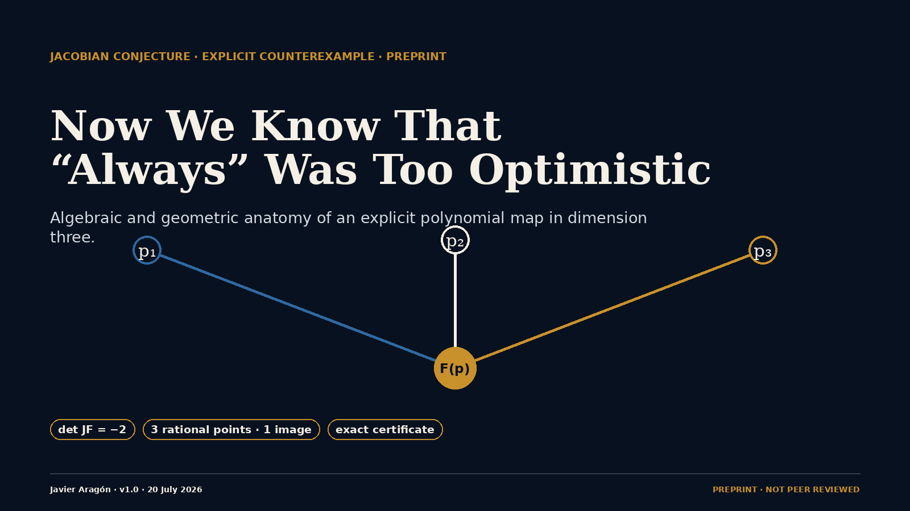

<p align="center"></p>

# Now We Know That “Always” Was Too Optimistic

**English** · [Español](README.md)

[](https://github.com/javieraragonmartinez/forever-was-too-optimistic/actions/workflows/build-and-verify.yml)


Version 1.0 of an extremely recent preprint dated 20 July 2026. It has not
been peer reviewed. The elementary algebraic core is distributed together
with an exact certificate, a JSON Schema, deterministic generators and an
independent verifier using only the Python standard library.

## Elementary certificate

The polynomial map is

\[
F(x,y,z)=\left(
\begin{aligned}
 &(1+xy)^3z+y^2(1+xy)(4+3xy),\\
 &y+3x(1+xy)^2z+3xy^2(4+3xy),\\
 &2x-3x^2y-x^3z
\end{aligned}
\right).
\]

Exact differentiation gives

\[
\det JF=-2.
\]

Nevertheless, the three distinct rational points

\[
(0,0,-1/4),\qquad (1,-3/2,13/2),\qquad (-1,3/2,13/2)
\]

have the common image

\[
(-1/4,0,0).
\]

Thus the map has a constant non-zero Jacobian determinant but is not
injective. The manuscript studies its fibers and global geometry and gives a
constructive Bass–Connell–Wright/Yagzhev reduction to dimension 79.

## Scientific status

- Independent preprint; not peer reviewed.
- Exact identities and collisions can be checked by separate implementations.
- Priority, attribution and broader implications remain open to external review.
- The DOI `10.5281/zenodo.21460623` is reserved and pending publication.
- No institutional endorsement is inferred from third-party discussions,
  repositories or pull requests.

## Reproduce and verify

```bash
python -m pip install -r requirements.txt
python scripts/bcw_yagzhev_certificate.py --write-artifact artifacts/bcw-yagzhev-dim79.json
python scripts/verify_bcw_yagzhev_artifact.py artifacts/bcw-yagzhev-dim79.json
python -m jsonschema -i artifacts/bcw-yagzhev-dim79.json artifacts/bcw-yagzhev-certificate.schema.json
python -m unittest discover -s tests -p 'test_*.py' -v
```

Compile the paper with three `pdflatex` passes. The repository automation also
regenerates the PDF, certificate, social graphics and SHA-256 manifest.

## Visual and communication materials

- `assets/`: academic repository cover, social preview and visual abstract.
- `carousel-v2/`: revised ten-panel academic carousel.
- [Editable Figma source](https://www.figma.com/design/Zz8DXi2BvnEV0f4rWOaI1F).

See `docs/ATTRIBUTION.md`, `docs/MATHEMATICAL_SCOPE.md` and
`docs/REPRODUCIBILITY.md` before citing or extending the result.
