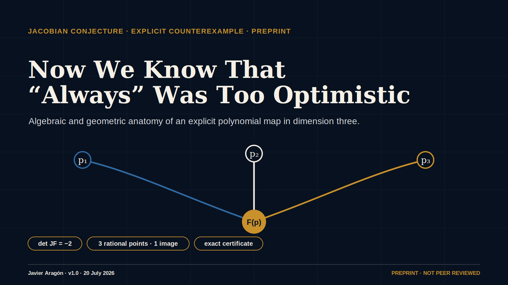

<p align="center"></p>

# Ahora sabemos que “siempre” era demasiado optimista

[English](README.en.md) · **Español**

[](https://github.com/javieraragonmartinez/forever-was-too-optimistic/actions/workflows/build-and-verify.yml)


**English title:** *Now We Know That “Always” Was Too Optimistic*

Versión 1.0 de un preprint extremadamente reciente, fechado el 20 de julio de
2026. No ha sido revisado por pares. El núcleo algebraico se acompaña de un
certificado exacto, un esquema JSON y un verificador independiente que usa
solo la biblioteca estándar de Python.

## El certificado elemental

El mapa polinómico es

\[
F(x,y,z)=\left(
\begin{aligned}
 &(1+xy)^3z+y^2(1+xy)(4+3xy),\\
 &y+3x(1+xy)^2z+3xy^2(4+3xy),\\
 &2x-3x^2y-x^3z
\end{aligned}
\right).
\]

La diferenciación exacta da

\[
\det JF=-2.
\]

Sin embargo, los tres puntos racionales distintos

\[
(0,0,-1/4),\qquad (1,-3/2,13/2),\qquad (-1,3/2,13/2)
\]

tienen la imagen común

\[
(-1/4,0,0).
\]

Por tanto, el mapa tiene determinante jacobiano constante y no nulo, pero no
es inyectivo. El manuscrito estudia sus fibras y su geometría global y ofrece
una reducción constructiva Bass–Connell–Wright/Yagzhev hasta dimensión 79.

## Estado científico

- Preprint independiente; no revisado por pares.
- Las identidades exactas y las colisiones pueden comprobarse mediante implementaciones separadas.
- La prioridad, la atribución y las implicaciones más amplias quedan abiertas a revisión externa.
- El DOI `10.5281/zenodo.21460623` está reservado y pendiente de publicación.
- No se infiere respaldo institucional de conversaciones, repositorios o pull requests de terceros.

## Reproducir y verificar

```bash
python -m pip install -r requirements.txt
python scripts/bcw_yagzhev_certificate.py --write-artifact artifacts/bcw-yagzhev-dim79.json
python scripts/verify_bcw_yagzhev_artifact.py artifacts/bcw-yagzhev-dim79.json
python -m jsonschema -i artifacts/bcw-yagzhev-dim79.json artifacts/bcw-yagzhev-certificate.schema.json
python -m unittest discover -s tests -p 'test_*.py' -v
```

El artículo se compila con tres pasadas de `pdflatex`. La automatización del
repositorio también regenera el PDF, el certificado, los gráficos sociales y
el manifiesto SHA-256.

## Materiales visuales y de comunicación

- [`assets/repository-cover.svg`](assets/repository-cover.svg): portada académica visible en el README.
- [`assets/social-preview.svg`](assets/social-preview.svg): vista previa horizontal.
- [`social/`](social/): piezas editoriales listas para adaptar y publicar.
- `carousel-v2/`: carrusel académico revisado de diez láminas.
- [Fuente editable en Figma](https://www.figma.com/design/Zz8DXi2BvnEV0f4rWOaI1F).

Consulta `docs/ATTRIBUTION.md`, `docs/MATHEMATICAL_SCOPE.md` y
`docs/REPRODUCIBILITY.md` antes de citar o extender el resultado.
